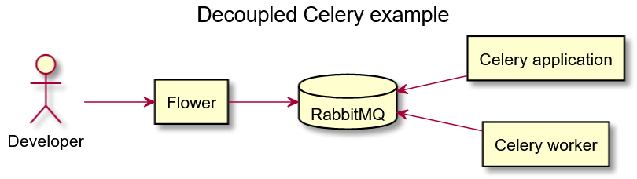

# Decoupled Celery example

This repo is an example of how the [Celery](https://docs.celeryproject.org/en/stable/) application and Celery worker can be decoupled and executed in different containers.

Companion articles:

- [Separating Celery application and worker in Docker containers](https://medium.com/@tanchinhiong/separating-celery-application-and-worker-in-docker-containers-f70fedb1ba6d)
- [Separating application and worker containers in Celery 5](https://medium.com/@tanchinhiong/separating-application-and-worker-containers-in-celery-5-5cd3239ecd42)


## System diagram



## Pre-requisite

- `docker-compose`
- `make`

## Getting started

```bash
# Use make to run docker-compose
make recompose
```

Access Flower web UI at <http://localhost:8888>
